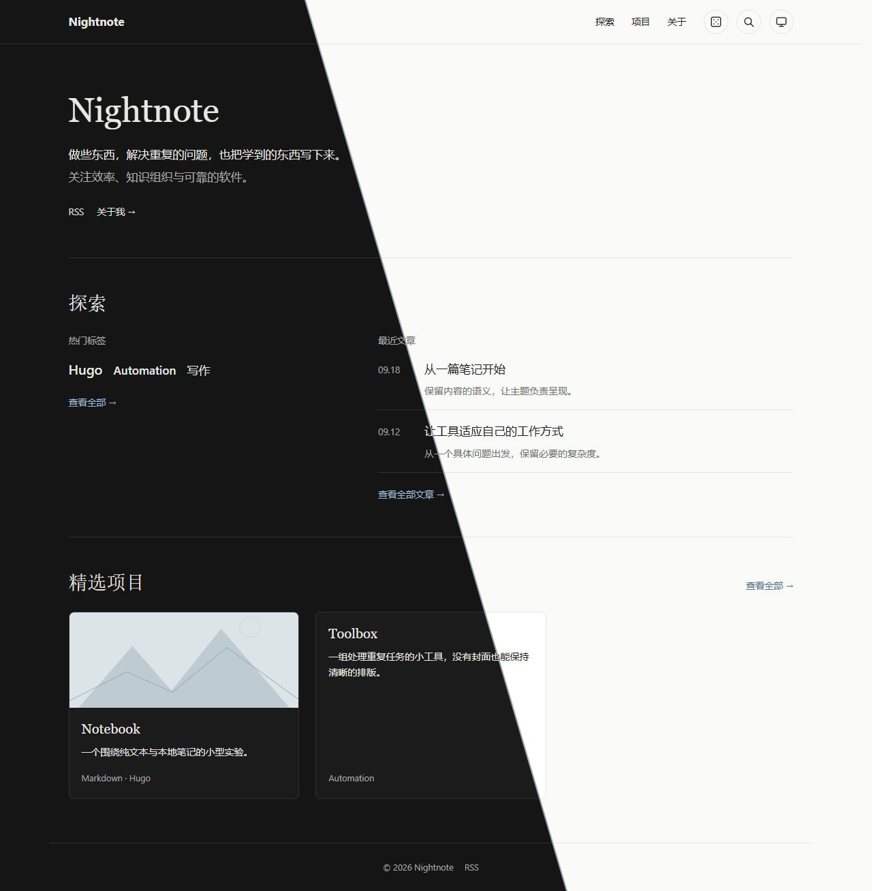
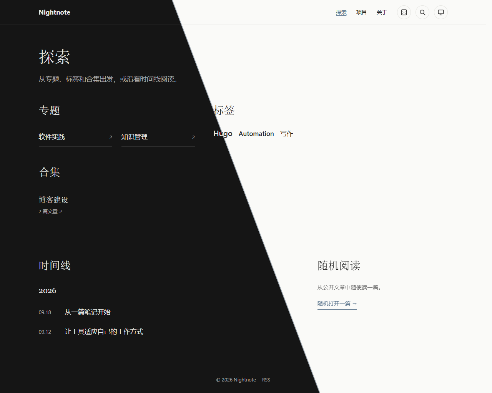
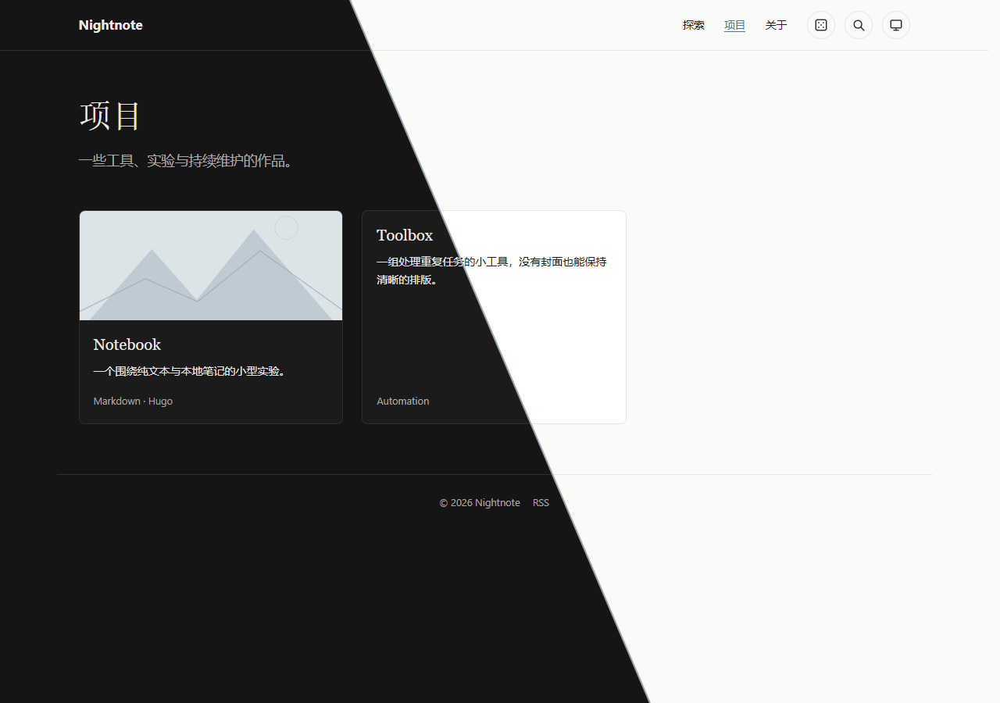
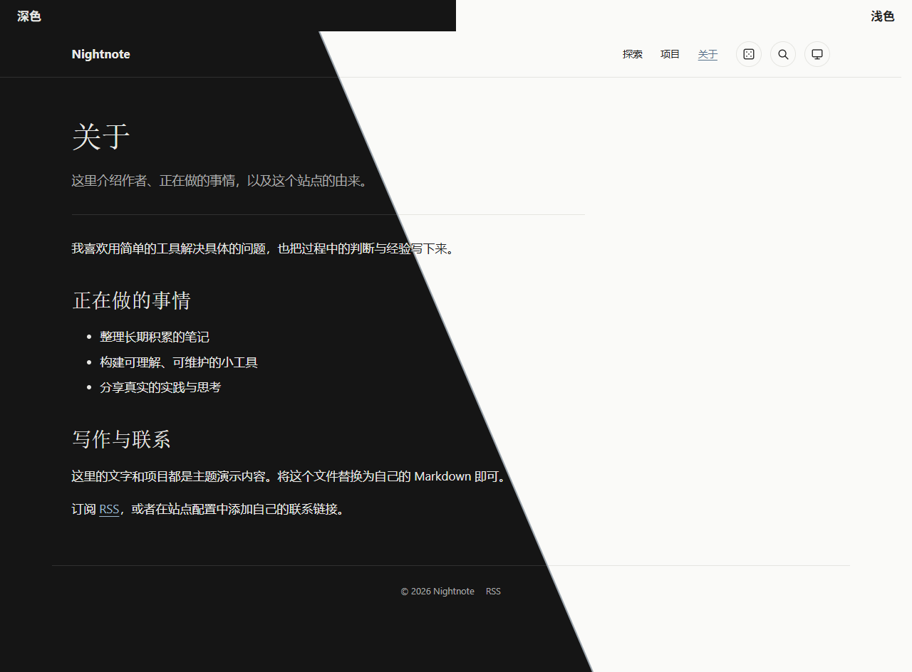

# Nightnote

Nightnote 是面向 Obsidian 笔记的 Hugo 个人博客主题，采用简洁的编辑式排版。界面目前为中文，支持文章、项目、专题、标签云、合集、时间线、搜索、随机阅读与明暗外观。主题只负责呈现；公开内容的选择、双链与附件转换应由站点的发布流程完成。

本仓库名为 [`hugo-theme-nightnote`](https://github.com/seeyou2n1ght/hugo-theme-nightnote)，主题展示名和 Hugo 安装目录仍为 **Nightnote / `nightnote`**。已使用 Hugo v0.166.0 验证，最低版本为 v0.166.0。

## 视觉预览

以下整页截图来自仓库自带的独立 `exampleSite/`。合成图沿对角线展示深色（左）和浅色（右）；每页也提供未经合成的原图，便于查看完整细节。

### 首页



[深色原图](docs/screenshots/home-dark.png) · [浅色原图](docs/screenshots/home-light.png)

### 探索



[深色原图](docs/screenshots/explore-dark.png) · [浅色原图](docs/screenshots/explore-light.png)

### 项目



[深色原图](docs/screenshots/projects-dark.png) · [浅色原图](docs/screenshots/projects-light.png) · [390px 窄屏深色原图](docs/screenshots/projects-mobile-dark.png)

### 关于我



[深色原图](docs/screenshots/about-dark.png) · [浅色原图](docs/screenshots/about-light.png)

## 安装与使用

在 Hugo 站点根目录安装主题：

```sh
git clone https://github.com/seeyou2n1ght/hugo-theme-nightnote.git themes/nightnote
```

主题可直接渲染普通 Hugo 内容；发布资格由站点侧 Publisher 决定，不能把完整 Vault 直接交给 Hugo。`hugo.toml` 至少需要以下配置。搜索与随机阅读依赖 `search.json`；数学公式使用下方的 Goldmark passthrough 配置。

```toml
baseURL = 'https://blog.example.com/'
title = 'Nightnote'
defaultContentLanguage = 'zh'
hasCJKLanguage = true
theme = 'nightnote'

[languages.zh]
  locale = 'zh-CN'

[taxonomies]
  category = 'category'
  tag = 'tags'
  collection = 'collection'

[permalinks.page]
  posts = '/posts/:slug/'
  projects = '/projects/:slug/'

[permalinks.taxonomy]
  category = '/topics/'
  collection = '/collections/'

[permalinks.term]
  category = '/topics/:slug/'
  collection = '/collections/:slug/'

[outputs]
  home = ['HTML', 'RSS', 'Search']

[outputFormats.Search]
  mediaType = 'application/json'
  baseName = 'search'
  isPlainText = true
  notAlternative = true

[markup.goldmark.extensions.passthrough]
  enable = true

[markup.goldmark.extensions.passthrough.delimiters]
  block = [['$$', '$$']]
  inline = [['$', '$']]
```

站点内容放在 `content/posts/`、`content/projects/`；关于页使用 `content/about/index.md`，并在 Front Matter 中设置 `type: about`。探索页使用 `content/explore/_index.md`。可选的 `params.intro`、`params.focus`、`params.github`、`params.email` 分别用于首页简介、关注方向和联系链接。配置完成后，在站点根目录运行 `hugo server` 预览，运行 `hugo` 构建静态文件。

### 示例站与 Publisher

`exampleSite/` 是独立演示站点，包含关于页、文章和项目的完整 Page Bundle。只想试用主题时，可复制其 `hugo.toml` 与 `content/` 到新站点，修改 `baseURL`、标题、简介和联系信息，并在正式构建前替换或删除演示内容。

使用 Obsidian Publisher 时，只复制 `exampleSite/hugo.toml` 作为配置起点，**不要复制演示 `content/`**。Publisher 独占站点 `content/`，负责筛选公开笔记、转换双链与附件、生成 Page Bundle；首次成功发布时会创建文章、项目和探索栏目页。主题仓库本身不包含 Publisher。

## 元数据约束

每篇文章和每个项目使用 `posts/<slug>/index.md` 或 `projects/<slug>/index.md` 作为 leaf bundle，图片放在同一目录；栏目页使用 `_index.md` 作为 branch bundle。下面是文章的 `index.md` 示例；项目放在 `projects` 目录。

```yaml
---
title: 示例文章
slug: example-post
date: 2026-09-22
description: 一句话摘要
category: Writing
tags: [Hugo, Obsidian]
collection: 博客建设 # 可选
cover: cover.png # 可选
---
```

主题展示 Hugo 已加载的页面。`title`、`date` 和正文足够渲染普通文章；`category`、`tags`、`collection`、`description` 和 `cover` 均可选。项目可使用 `featured: true` 和 `links: [{name, url}]`；文章可用 `project` 保存关联项目的站内 URL。

**主题不是发布闸门。** 发布前须在站点侧校验元数据、筛选公开笔记与附件，并处理 Obsidian 双链；不要直接把完整笔记仓库交给 Hugo。Mermaid 和 KaTeX 按需从公共 CDN 加载，默认 Open Graph 配图为 SVG。

## 许可证

主题源码、示例内容和预览资源均采用 [MIT License](LICENSE)；个人站点内容不包含在主题中。

## 独立预览与检查

主题不依赖外层个人站点、Obsidian 仓库、Node.js 或 Python 第三方包。`exampleSite/` 包含独立演示数据（含中文分类、有封面与无封面的项目）。克隆时使用 `nightnote` 作为目录名：

```sh
git clone https://github.com/seeyou2n1ght/hugo-theme-nightnote.git nightnote
cd nightnote
hugo server --source exampleSite --themesDir ../..
```

使用 Hugo 0.166.0 或更新版本；Python 3 仅用于运行回归检查：

```sh
python -m unittest discover -s tests -v
hugo --source exampleSite --themesDir ../.. --minify
```

构建结果位于 `exampleSite/public/`，不应提交到主题仓库。发布前检查首页、探索、项目列表/详情、关于页和文章页的浅色、深色及 390px 窄屏表现，并验证菜单、搜索、目录、图片与键盘操作。没有专门验证真实 iOS/Safari 时，不应将浏览器窄屏模拟视为真机验收。

## 页面与视觉约定

- 保留左对齐简介、纯文本标签云、文章列表和项目卡片；首页仅在存在精选项目时展示对应模块。
- `content/projects/_index.md` 的 `title`、`description` 和正文可定制项目页介绍；探索页使用 `_index.md` 的标题与摘要。关于页由 `content/about/index.md` 正文驱动，不需要额外模板或个人信息硬编码。
- 文章与关于页使用适合长文的行宽；所有页面共享字体、颜色、间距和组件样式。明暗模式及减少动画偏好均由原生 CSS 处理。
- `assets/css/site.css` 保持可读源码，颜色、字体与模块间距集中在 `:root`。站点可覆盖同路径资源进行定制。Hugo 在构建时压缩并为 CSS/JS 添加内容指纹，避免部署后命中旧资源缓存。
- 搜索匹配标题和摘要；标签/合集发现入口统计文章，专题统计文章与项目。直接访问项目标签页时会显示相关项目。
- 当前界面为中文，导航约定使用 `explore/`、`projects/`、`about/`；尚未提供多语言界面词条。
