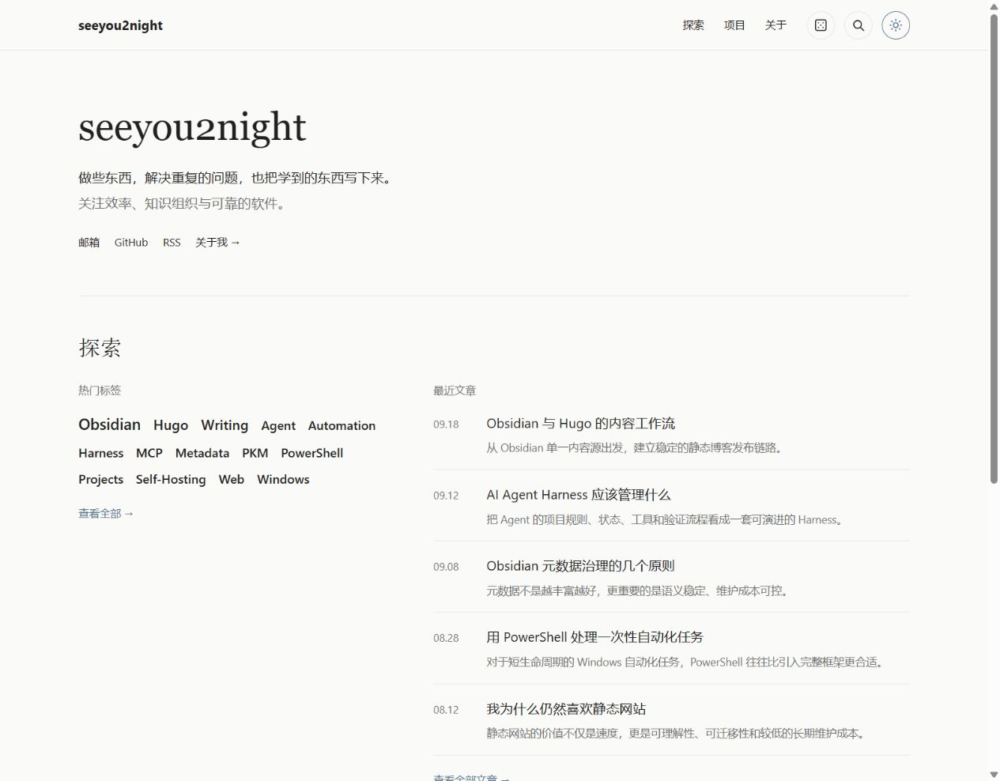
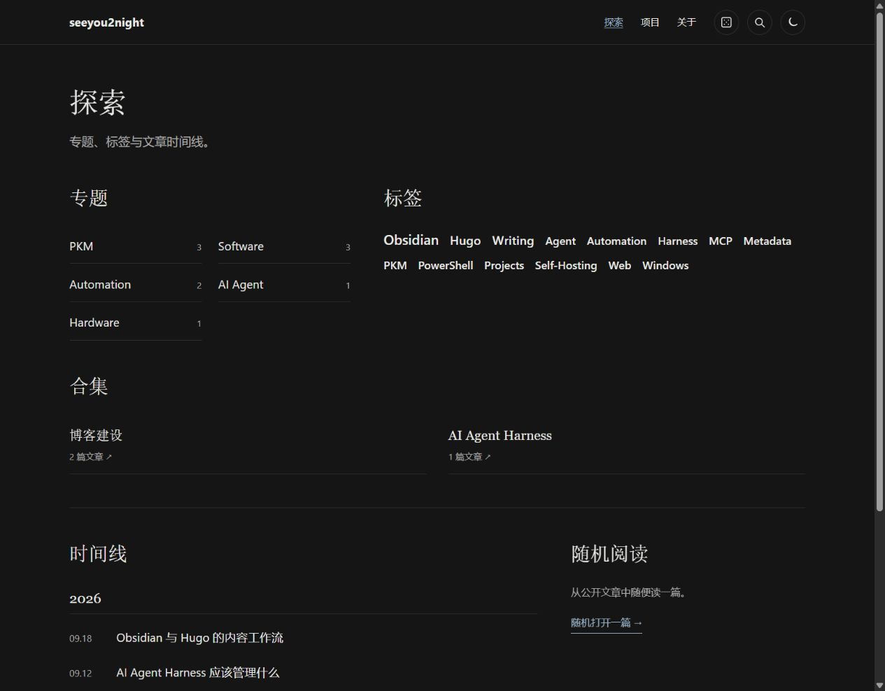
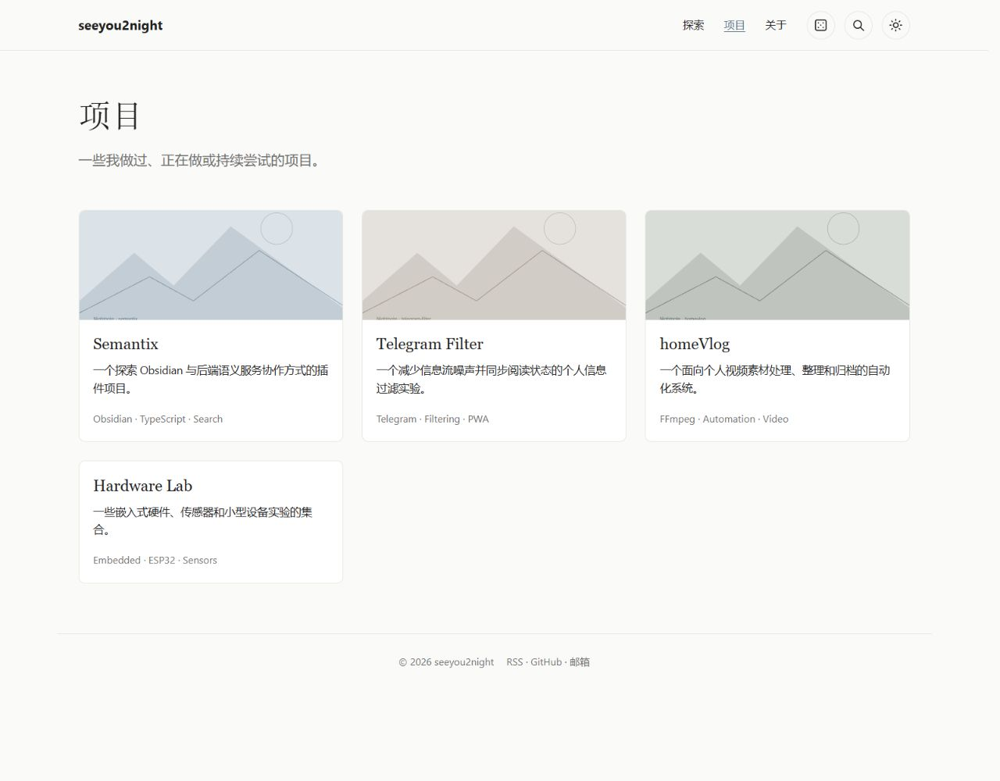
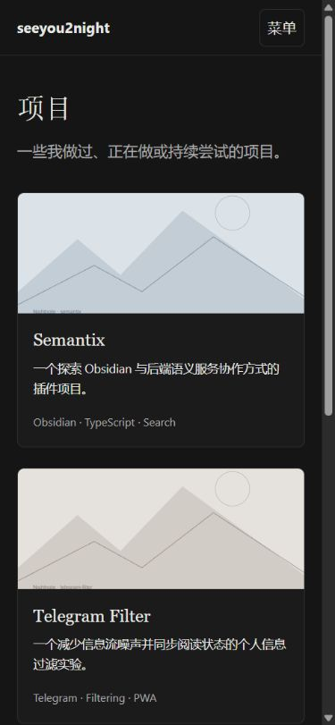

# Nightnote

Nightnote 是面向 Obsidian 笔记的 Hugo 个人博客主题，采用简洁的编辑式排版。界面目前为中文，支持文章、项目、专题、标签云、合集、时间线、搜索、随机阅读与明暗外观。主题只负责呈现；公开内容的选择、双链与附件转换应由站点的发布流程完成。

本仓库名为 [`hugo-theme-nightnote`](https://github.com/seeyou2n1ght/hugo-theme-nightnote)，主题展示名和 Hugo 安装目录仍为 **Nightnote / `nightnote`**。已使用 Hugo v0.166.0 验证，最低版本为 v0.166.0。

## 视觉预览

以下为此前本地测试站点的截图，展示主题在实际内容中的效果；仓库自带的 `exampleSite/` 使用独立演示内容。

### 首页 · 浅色



### 探索 · 深色



### 项目 · 浅色



### 窄屏 · 深色



## 安装与使用

在 Hugo 站点根目录安装主题：

```sh
git clone https://github.com/seeyou2n1ght/hugo-theme-nightnote.git themes/nightnote
```

`hugo.yaml` 至少需要以下配置。搜索与随机阅读依赖 `search.json`；数学公式使用下方的 Goldmark passthrough 配置。

```yaml
baseURL: https://blog.example.com/
title: 我的博客
defaultContentLanguage: zh
hasCJKLanguage: true
languages:
  zh:
    locale: zh-CN
theme: nightnote
frontmatter:
  date: [published, date]
taxonomies:
  category: category
  tag: tags
  collection: collection
permalinks:
  posts: /posts/:slug/
  projects: /projects/:slug/
  taxonomy:
    category: /topics/
    collection: /collections/
  term:
    category: /topics/:slug/
    collection: /collections/:slug/
outputs:
  home: [HTML, RSS, Search]
outputFormats:
  Search:
    mediaType: application/json
    baseName: search
    isPlainText: true
    notAlternative: true
markup:
  goldmark:
    extensions:
      passthrough:
        enable: true
        delimiters:
          block: [['$$', '$$']]
          inline: [['$', '$']]
```

站点内容放在 `content/posts/`、`content/projects/`，并提供 `content/about.md` 和 `content/explore/_index.md`。可选的 `params.intro`、`params.focus`、`params.github`、`params.email` 分别用于首页简介、关注方向和联系链接。配置完成后，在站点根目录运行 `hugo server` 预览，运行 `hugo` 构建静态文件。

## 元数据约束

下面是文章示例；项目放在 `projects` 并将 `noteType` 设为 `project`。图片建议与 `index.md` 放在同一个 Page Bundle 中。

```yaml
---
title: 示例文章
noteId: c6f18e3e-a9a0-45a3-a1f9-5eed03f8e1c9
slug: example-post
noteType: note
private: false
publishStatus: published
published: 2026-09-22
description: 一句话摘要
category: Writing
tags: [Hugo, Obsidian]
collection: 博客建设 # 可选
cover: cover.png # 可选
---
```

主题仅展示 `private: false` 且 `publishStatus: published` 的普通页面，并从 `published` 读取日期。`category` 是单个专题，可同时关联文章与项目；`tags` 是数组，`collection` 是可选合集。项目还可使用 `featured: true` 和 `links`；文章可用 `project` 保存关联项目的站内 URL。`noteId` 用于 Obsidian 发布流程识别笔记更新，主题本身不使用它。

**主题不是发布闸门。** 发布前须在站点侧校验元数据、筛选公开笔记与附件，并处理 Obsidian 双链；不要直接把完整笔记仓库交给 Hugo。Mermaid 和 KaTeX 按需从公共 CDN 加载，默认 Open Graph 配图为 SVG。

## 许可证

主题源码采用 [MIT License](LICENSE)。本仓库内的示例内容与示例 SVG 同样采用 MIT License；个人站点内容不包含在主题中。

## 独立预览与检查

主题不依赖外层个人站点、Obsidian 仓库、Node.js 或 Python 第三方包。`exampleSite/` 包含独立演示数据（含中文分类、有封面与无封面的项目）。克隆时使用 `nightnote` 作为目录名：

```sh
git clone https://github.com/seeyou2n1ght/hugo-theme-nightnote.git nightnote
cd nightnote
hugo server --source exampleSite --themesDir ../..
```

使用 Hugo 0.166.0 或更新版本；Python 3 仅用于运行回归检查：

```sh
python -m unittest discover -s tests -v
hugo --source exampleSite --themesDir ../.. --minify
```

构建结果位于 `exampleSite/public/`，不应提交到主题仓库。发布前检查首页、探索、项目列表/详情、关于页和文章页的浅色、深色及 390px 窄屏表现，并验证菜单、搜索、目录、图片与键盘操作。没有专门验证真实 iOS/Safari 时，不应将浏览器窄屏模拟视为真机验收。

## 页面与视觉约定

- 保留左对齐简介、纯文本标签云、文章列表和项目卡片；首页仅在存在精选项目时展示对应模块。
- `content/projects/_index.md` 的 `title`、`description` 和正文可定制项目页介绍；探索页使用 `_index.md` 的标题与摘要。关于页由 `content/about.md` 正文驱动，不需要额外模板或个人信息硬编码。
- 文章与关于页使用适合长文的行宽；所有页面共享字体、颜色、间距和组件样式。明暗模式及减少动画偏好均由原生 CSS 处理。
- `assets/css/site.css` 保持可读源码，颜色、字体与模块间距集中在 `:root`。站点可覆盖同路径资源进行定制。Hugo 在构建时压缩并为 CSS/JS 添加内容指纹，避免部署后命中旧资源缓存。
- 搜索匹配标题和摘要；标签/合集发现入口统计文章，专题统计文章与项目。直接访问项目标签页时会显示相关项目。
- 当前界面为中文，导航约定使用 `explore/`、`projects/`、`about/`；尚未提供多语言界面词条。
